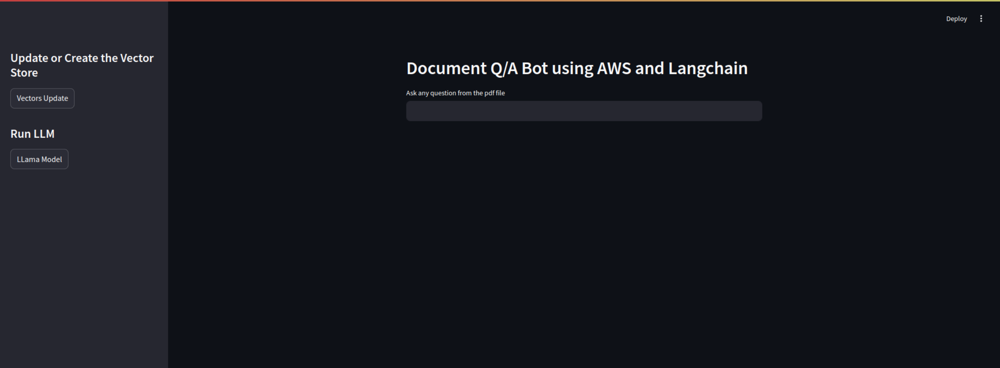

# Document Question-Answering System using AWS Bedrock and LangChain

This application provides a question-answering system powered by AWS Bedrock and LangChain. It uses RAG (Retrieval-Augmented Generation) to answer questions based on PDF documents.

## Application Interface




## 🌟 Features

- PDF document ingestion and processing
- Vector embeddings using AWS Bedrock's Titan model
- Question answering using AWS Bedrock's LLama 3 model
- Streamlit web interface
- Containerized deployment with Docker
- AWS ECR and App Runner integration

## 📋 Prerequisites

- AWS Account with Bedrock access
- AWS CLI configured with appropriate permissions
- Docker installed locally
- Python 3.9 or higher

## 🔧 Installation

1. Clone the repository:
```bash
git clone https://github.com/shivangsingh26/RagDeployment.git
cd RAG_APP_AWS
```

2. Create and activate a virtual environment(For Ubuntu):
```bash
python -m venv venvRagApp
source venvRagApp/bin/activate  # On Windows: venv\Scripts\activate
```

3. Install dependencies:
```bash
pip install -r requirements.txt
```

## 📦 Required Files

### requirements.txt
```txt
langchain
langchainhub
bs4
tiktoken
boto3==1.34.37
langchain_community
awscli
streamlit
pypdf
faiss-cpu
```

### Dockerfile
```dockerfile
FROM python:3.9-slim-buster

WORKDIR /app

COPY . /app/

RUN pip install -r requirements.txt

EXPOSE 8501

CMD ["streamlit", "run", "app.py"]
```

## 🚀 Local Usage

1. Configure AWS credentials:
```bash
aws configure
# Enter your AWS Access Key ID
# Enter your AWS Secret Access Key
# Enter your default region (e.g., us-east-1)
# Enter your output format (e.g., json)
```

2. Place your PDF documents in the `data` directory.

3. You can run the application **locally**:
```bash
streamlit run app.py
```

4. Access the application at `http://localhost:8501`

## 🐳 Docker Build and Run Locally

```bash
# Build the Docker image
docker build -t rag-app .

# Run the container with AWS credentials
docker run -p 8501:8501 \
  -v ~/.aws:/root/.aws \
  rag-app
```

## ☁️ AWS Deployment

### 1. Push to Amazon ECR

```bash
# Get AWS Account ID
export AWS_ACCOUNT_ID=$(aws sts get-caller-identity --query Account --output text)

# Login to Amazon ECR
aws ecr get-login-password --region us-east-1 | docker login --username AWS --password-stdin ${AWS_ACCOUNT_ID}.dkr.ecr.us-east-1.amazonaws.com

# Create ECR repository (if it doesn't exist)
aws ecr create-repository \
    --repository-name rag-app \
    --image-scanning-configuration scanOnPush=true \
    --region us-east-1

# Tag the image
docker tag rag-app:latest ${AWS_ACCOUNT_ID}.dkr.ecr.us-east-1.amazonaws.com/rag-app:latest

# Push the image
docker push ${AWS_ACCOUNT_ID}.dkr.ecr.us-east-1.amazonaws.com/rag-app:latest
```

### 2. Deploy to App Runner

#### Using AWS Console:

1. Go to AWS App Runner console
2. Click "Create service"
3. Select Container registry
   - Repository: Select your ECR repository (rag-app)
   - Tag: latest
4. Configure service:
   ```
   Service name: rag-app-service
   Port: 8501
   CPU: 1 vCPU
   Memory: 2 GB
   ```
5. Add environment variables:
   ```
   AWS_DEFAULT_REGION=us-east-1
   ```
6. Configure IAM role with necessary permissions for Bedrock and other AWS services

#### Using AWS CLI:

```bash
# Create App Runner service
aws apprunner create-service \
  --service-name rag-app-service \
  --source-configuration '{
    "AuthenticationConfiguration": {
      "AccessRoleArn": "arn:aws:iam::${AWS_ACCOUNT_ID}:role/service-role/AppRunnerECRAccessRole"
    },
    "ImageRepository": {
      "ImageIdentifier": "${AWS_ACCOUNT_ID}.dkr.ecr.us-east-1.amazonaws.com/rag-app:latest",
      "ImageRepositoryType": "ECR"
    },
    "AutoDeploymentsEnabled": true
  }' \
  --instance-configuration '{
    "Cpu": "1 vCPU",
    "Memory": "2 GB",
    "InstanceRoleArn": "arn:aws:iam::${AWS_ACCOUNT_ID}:role/AppRunnerServiceRole"
  }' \
  --health-check-configuration '{
    "Protocol": "TCP",
    "Path": "/",
    "Interval": 10,
    "Timeout": 5,
    "HealthyThreshold": 1,
    "UnhealthyThreshold": 3
  }'
```

Example App Runner URL structure:
```
https://[service-id].us-east-1.awsapprunner.com
```

## 💰 Cost Optimization Tips

1. Use App Runner's auto-scaling:
```bash
aws apprunner update-service \
  --service-arn [your-service-arn] \
  --auto-scaling-configuration-arn [your-auto-scaling-config-arn]
```

2. Configure auto-scaling rules:
```bash
aws apprunner create-auto-scaling-configuration \
  --auto-scaling-configuration-name rag-app-scaling \
  --max-concurrency 50 \
  --max-size 2 \
  --min-size 1
```

3. Clean up unused resources:
```bash
# Remove old ECR images
aws ecr batch-delete-image \
  --repository-name rag-app \
  --image-ids imageTag=old-tag

# Delete App Runner service when not needed
aws apprunner delete-service \
  --service-arn [your-service-arn]
```

## 🔒 Required IAM Permissions

The service needs these permissions:
```json
{
    "Version": "2012-10-17",
    "Statement": [
        {
            "Effect": "Allow",
            "Action": [
                "bedrock:InvokeModel",
                "ecr:GetAuthorizationToken",
                "ecr:BatchCheckLayerAvailability",
                "ecr:GetDownloadUrlForLayer",
                "ecr:BatchGetImage"
            ],
            "Resource": "*"
        }
    ]
}
```

## 🔍 Troubleshooting

1. If the container fails to start:
   - Check App Runner logs
   - Verify AWS credentials and permissions
   - Ensure port 8501 is exposed correctly

2. If Bedrock calls fail:
   - Verify IAM permissions include Bedrock access
   - Check if Bedrock service is available in your region
   - Verify model quotas and limits

3. Common Docker issues:
   ```bash
   # Check container logs
   docker logs [container-id]
   
   # Shell into container
   docker exec -it [container-id] /bin/bash
   ```

## 📝 License

This project is licensed under the MIT License - see the LICENSE file for details.
